# Отчёт по отладке приложения

ФИО: Баков Андрей Игоревич

1. Шаг 1: Анализ и запуск.

- Что сделал: Запустил `docker compose up --build -d`, посмотрел логи `docker compose logs`
- Проблема: Приложение падало на старте из-за некорректной конфигурации БД.


- Решение: Исправил настройки DATABASE_URL в app/core/config.py.

Было:


Стало:


Итог - приложение запускается


2. Шаг 2: Повторный запуск (Ошибка парсинга).

- Что сделал: Запустил `docker compose up --build -d`, посмотрел логи `docker compose logs`
- Проблема: Парсинг падал из-за `city = null`.


- Причина:
  - обращение `item.city.name.strip()` без проверки `item.city` на `None`.
- Решение: Исправил код парсинга в app/services/parser.py.

Было:


Стало:


Итог - парсинг работает корректно


3. Шаг 3: Исправление бага (расписание парсинга).

- Описание проблемы: Фоновый парсинг запускался в секундах, а не в минутах.
- Файл: app/services/scheduler.py
- Причина: Неправильная единица времени в APScheduler.

Было:


Стало:


Итог - scheduler парсинга работает корректно


4. Шаг 4: Исправление бага (не закрывался HTTP-клиент).

- Описание проблемы: httpx.AsyncClient не закрывался, из-за чего в памяти приложения накапливался мусор.
- Файл: app/services/parser.py
- Причина: Отсутствовал механизм закрытия клиента.

Было:


Стало:


Итог - httpx.AsyncClient корректно закрывается

5. Шаг 5: Исправление бага (неверный статус при дубликате POST).

- Описание проблемы: При дубликате external_id API возвращал 200, а не конфликт.
- Файл: app/api/v1/vacancies.py


Возвращается статус 200, хотя логичнее возвращать ошибку 409 conflict

Было:

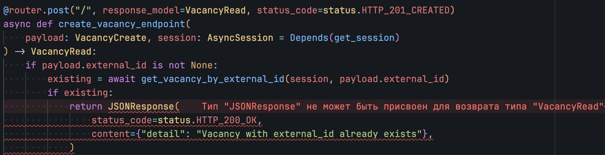

Стало:

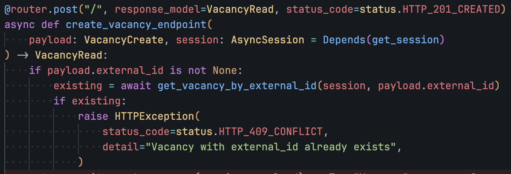

Итог - возвращается корректный статус код


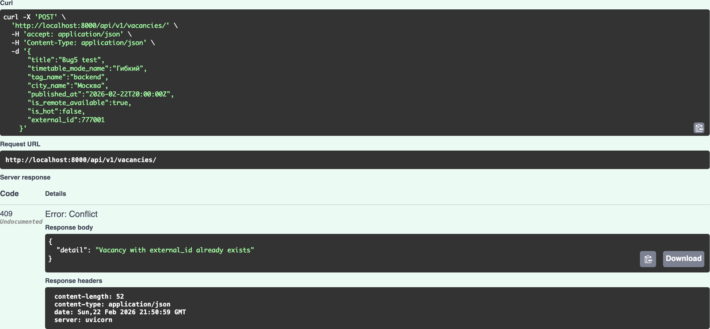

6. Шаг 6: Исправление бага (логика upsert по external_id).

- Описание проблемы: external_id=0 обрабатывался некорректно, тип existing_ids задан неверно.
- Файл: app/crud/vacancy.py
- Причина: Ошибка условий для nullable/integer-поля и неверный тип коллекции.

Было:

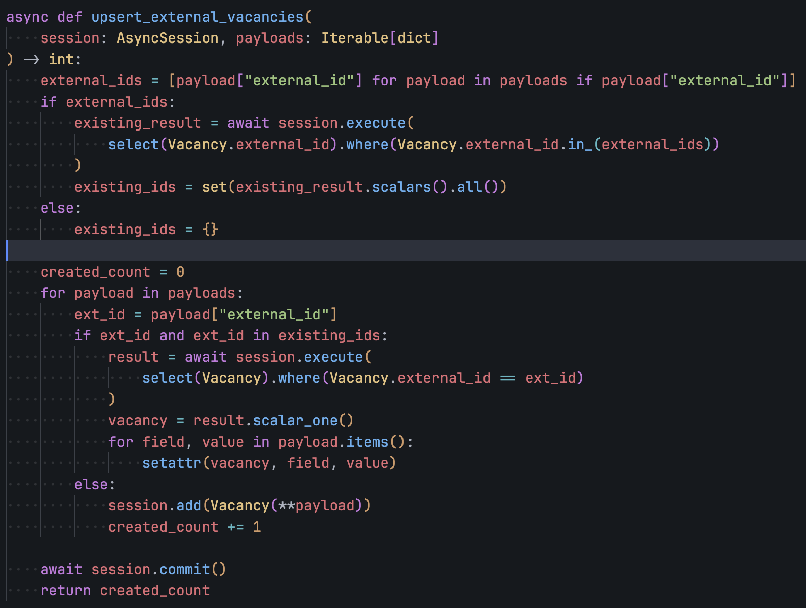

Стало:


Итог - поведение upsert стало корректным и предсказуемым для всех валидных external_id

7. Шаг 7: Исправление бага (конфликт при PUT).

- Описание проблемы: При обновлении вакансии на занятый external_id прилетал 500.
- Файл: app/api/v1/vacancies.py
- Причина: Необработанный unique conflict.

Сценарий ошибки:

Создадим 2 вакансии A и B
```json
{
    "title":"Bug7 A",
    "timetable_mode_name":"Гибкий",
    "tag_name":"backend",
    "city_name":"Москва",
    "published_at":"2026-02-22T20:00:00Z",
    "is_remote_available":true,
    "is_hot":false,
    "external_id":900001
}
```

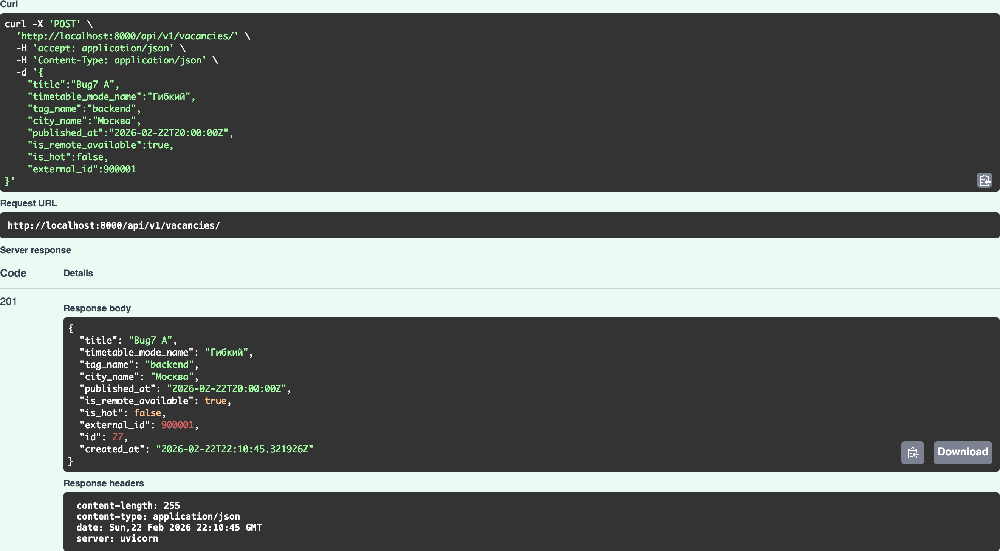


```json
{
    "title":"Bug7 B",
    "timetable_mode_name":"Фиксированный",
    "tag_name":"backend",
    "city_name":"СПб",
    "published_at":"2026-02-22T20:01:00Z",
    "is_remote_available":false,
    "is_hot":false,
    "external_id":900002
}
```

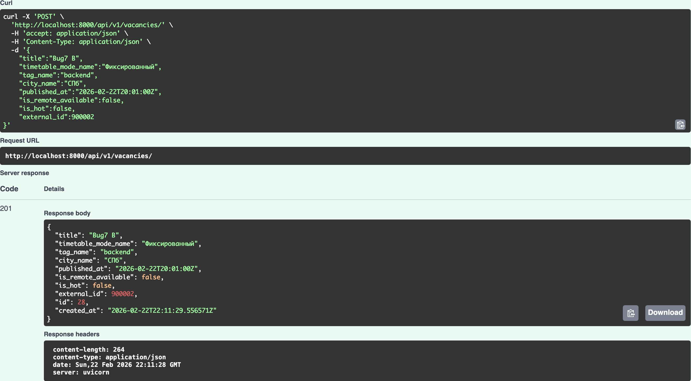


Пробуем у B поставить external_id от A

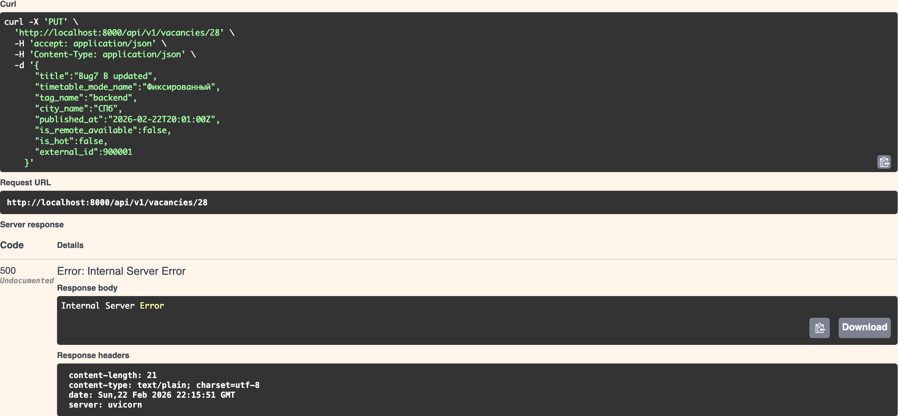

Было:


Стало:

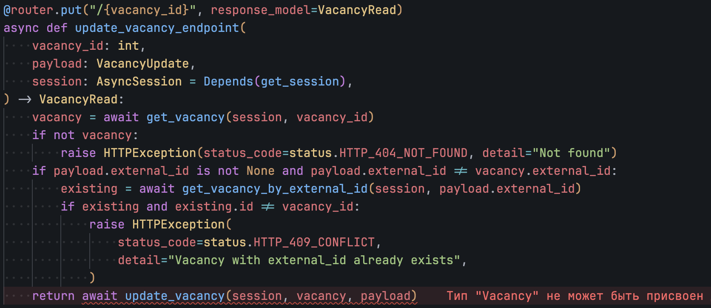

Итог - корректно обрабатывается ситуация с дублирующимся external_id при обновлении

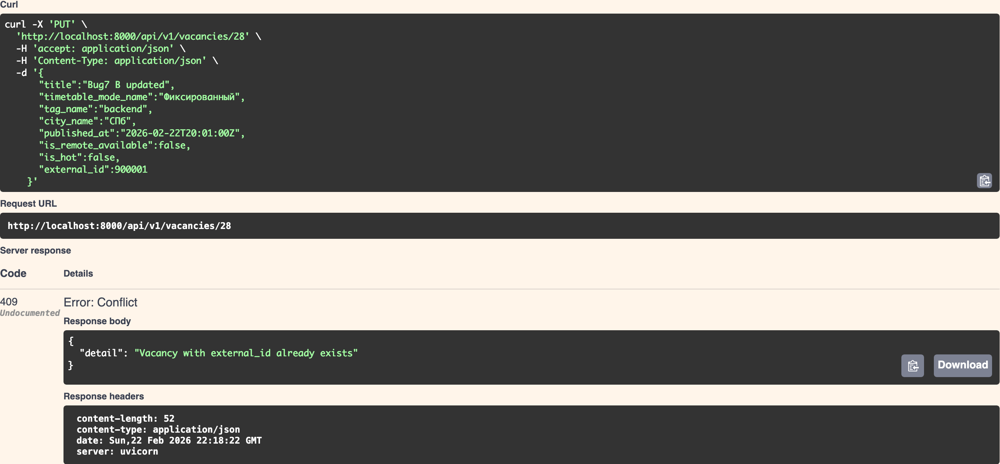

8. Шаг 8: Исправление бага (`/api/v1/parse/` всегда 200).

- Описание проблемы: даже при внутренний ошибки парсинга всегда возвращается 200
- Файл: app/services/parser.py, app/api/v1/parse.py
Причина: Ошибка бизнес-логики обработки исключений.

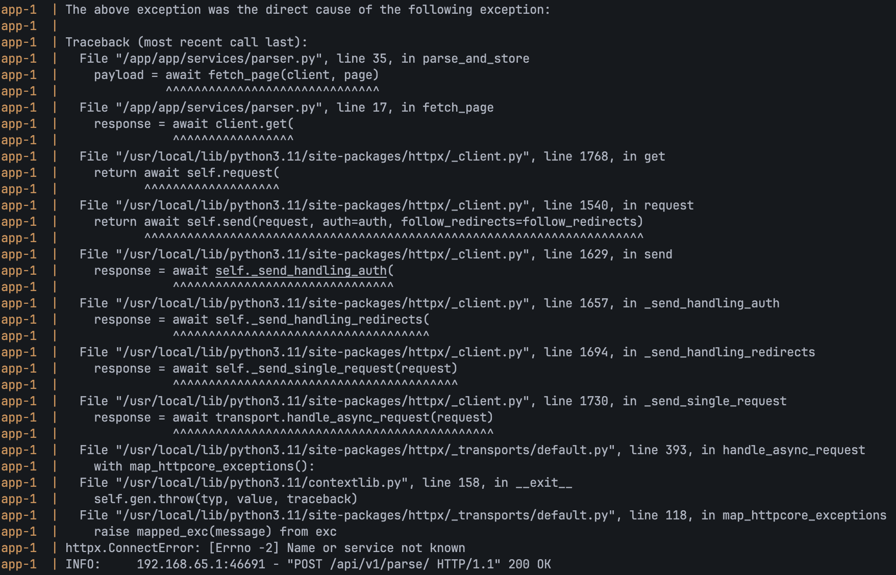

Фикс:

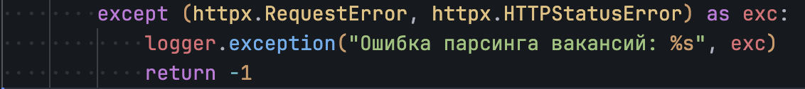
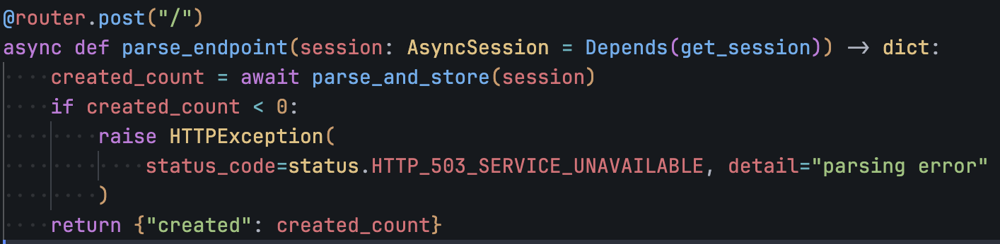


Итог - код возврата корректно отражает реальное состояние операции.

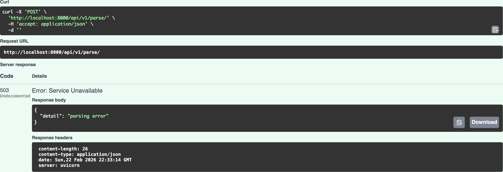
