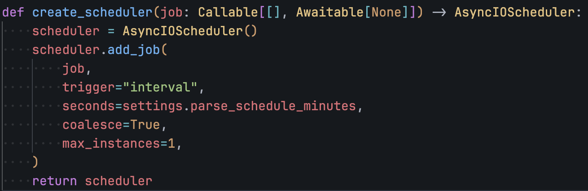
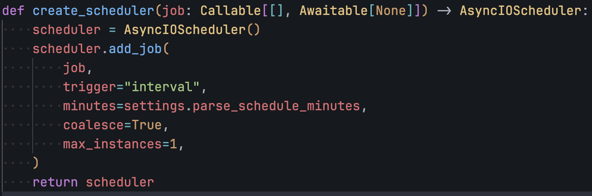
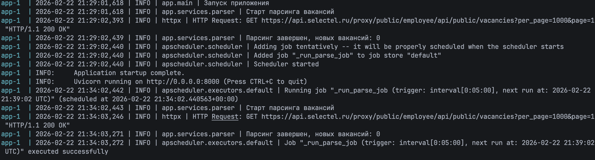
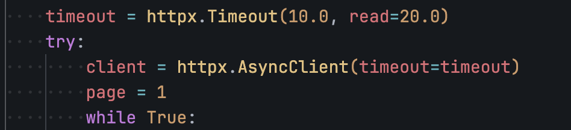
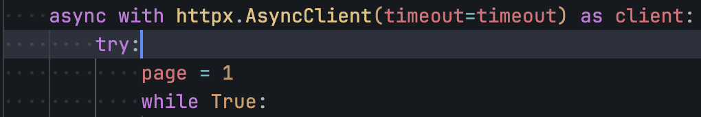

# Отчёт по отладке приложения

ФИО: Баков Андрей Игоревич

1. Шаг 1: Анализ и запуск.

- Что сделал: Запустил `docker compose up --build -d`, посмотрел логи `docker compose logs`
- Проблема: Приложение падало на старте из-за некорректной конфигурации БД.

- Решение: Исправил настройки DATABASE_URL в app/core/config.py.

Было:

Стало:

Итог - приложение запускается

2. Шаг 2: Повторный запуск (Ошибка парсинга).

- Что сделал: Запустил `docker compose up --build -d`, посмотрел логи `docker compose logs`
- Проблема: Парсинг падал из-за `city = null`.

- Причина:
  - обращение `item.city.name.strip()` без проверки `item.city` на `None`.
- Решение: Исправил код парсинга в app/services/parser.py.

Было:

Стало:

Итог - парсинг работает корректно

3. Шаг 3: Исправление бага (расписание парсинга).

- Описание проблемы: Фоновый парсинг запускался в секундах, а не в минутах.
- Файл: app/services/scheduler.py
- Причина: Неправильная единица времени в APScheduler.

Было:

Стало:

Итог - scheduler парсинга работает корректно

4. Шаг 4: Исправление бага (не закрывался HTTP-клиент).

- Описание проблемы: httpx.AsyncClient не закрывался, из-за чего в памяти приложения накапливался мусор.
- Файл: app/services/parser.py
- Причина: Отсутствовал механизм закрытия клиента.

Было:

Стало:

Итог - httpx.AsyncClient корректно закрывается
