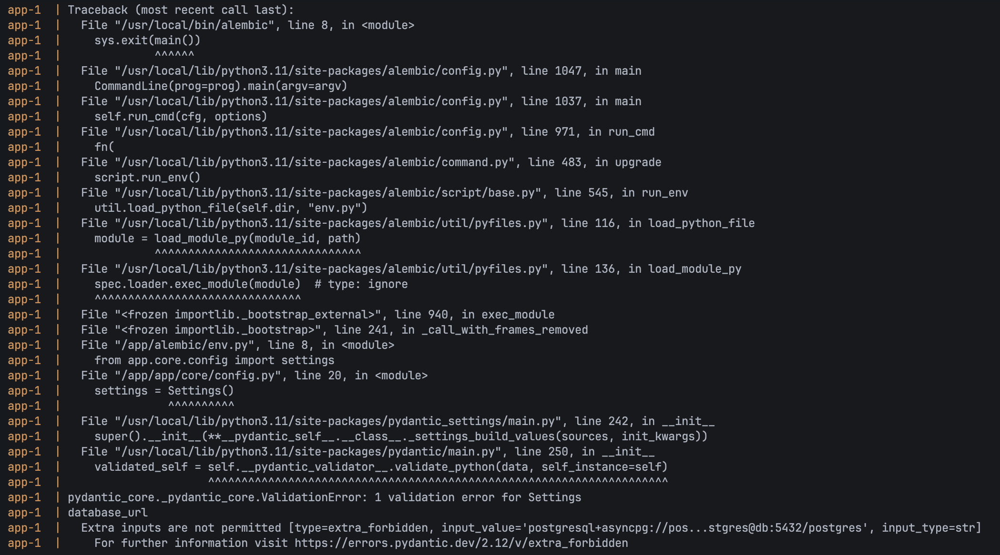
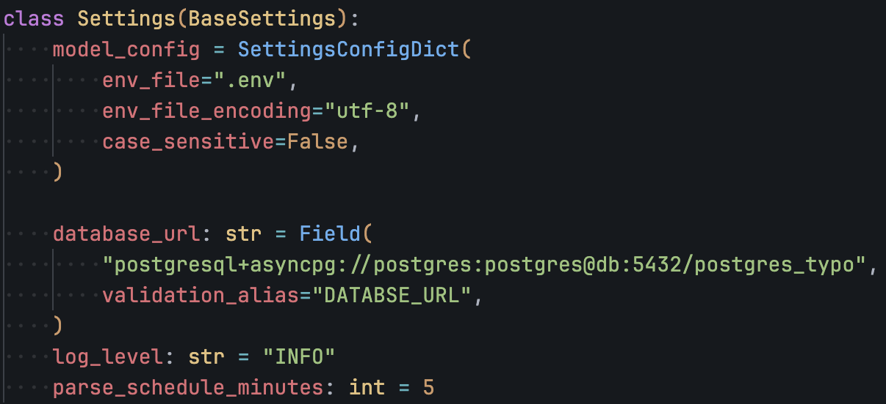
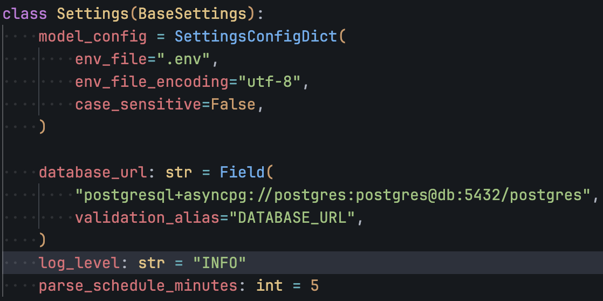
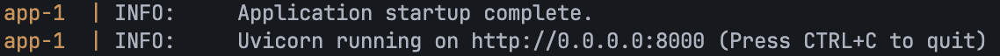
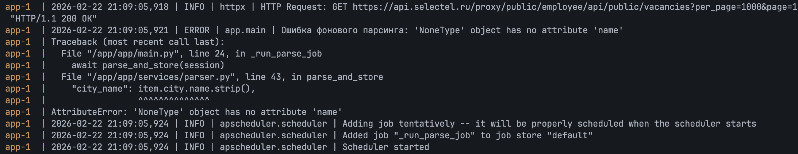
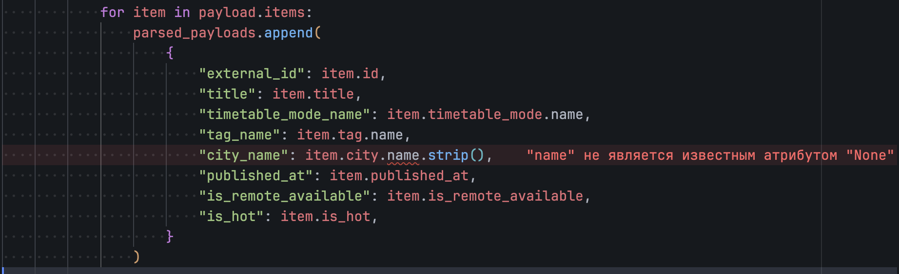
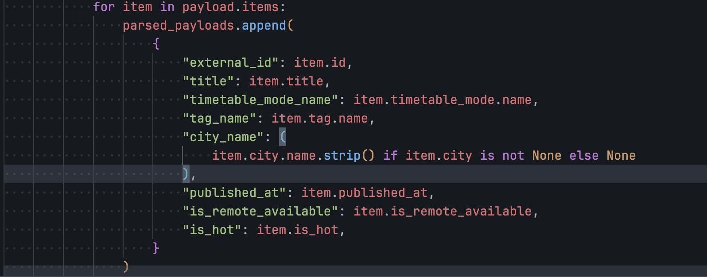
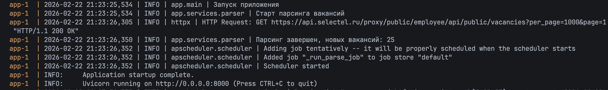

# Отчёт по отладке приложения

ФИО: Баков Андрей Игоревич

1. Шаг 1: Анализ и запуск.

- Что сделал: Запустил `docker compose up --build -d`, посмотрел логи `docker compose logs`
- Проблема: Приложение падало на старте из-за некорректной конфигурации БД.

- Решение: Исправил настройки DATABASE_URL в app/core/config.py.

Было:

Стало:

Итог - приложение запускается

2. Шаг 2: Повторный запуск (Ошибка парсинга).

- Что сделал: Запустил `docker compose up --build -d`, посмотрел логи `docker compose logs`
- Проблема: Парсинг падал из-за `city = null`.

- Причина:
  - обращение `item.city.name.strip()` без проверки `item.city` на `None`.
- Решение: Исправил код парсинга в app/services/parser.py.

Было:

Стало:

Итог - парсинг работает корректно

